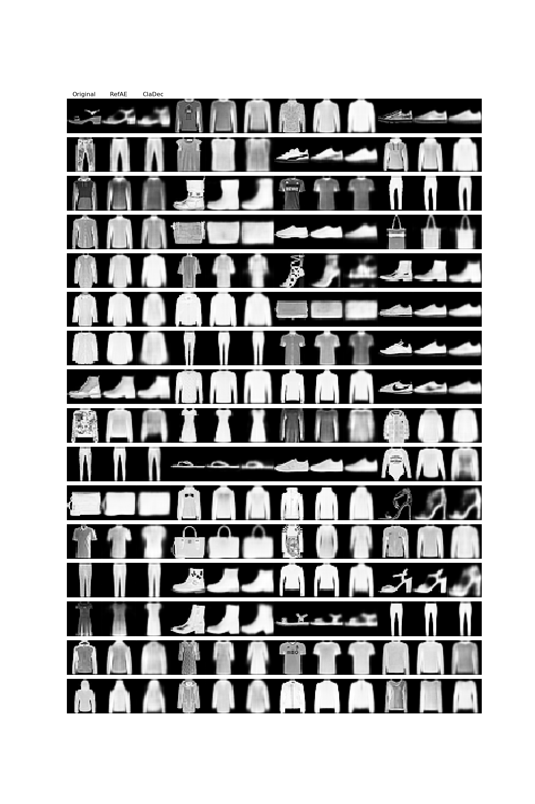
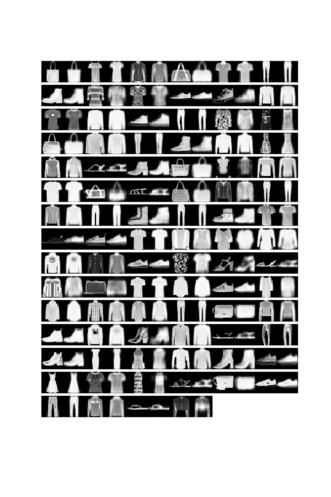

# Explaining Neural Networks by Decoding Layer Activations
Code for Paper: Explaining Neural Networks by Decoding Layer Activations
Accepted at Intelligent Data Analysis (IDA), 2021 (https://ida2021.org/)
https://arxiv.org/abs/2005.13630

It uses Python and Pytorch (The original code in the paper used TensorFlow).

It creates plots showing original and reconstructed samples (Explanations) by ClaDec. Things that are blurry or poorly reconstructed are not very relevant for classification. Sharp and well-matching parts between original and explanation are more important to the classifier. It can be observed, for example, that color (or grey scale information) or patterns (of clothes) are not relevant for the classifier, while shape is.

In the paper, you can see more samples, in particular a comparison with a reference decoder.

#Original and Explanations for last (logit) Layer

#Original and Explanations for last conv Layer]

